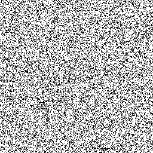
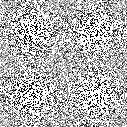
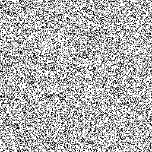

# Exploration

## Animations

## Ordre des voisins

Le meilleur ordre pour le parcours des voisins est 

## Taille des structures

On voit que....
C'est lié à....

## Pire cas (tas quadratique)

# Vue dégagée

## Accès

...

## Défauts

## Analyse des comportements

On voit que...
Ça s'explique parce que...

## Tests additionnels

On a aussi regardé....
