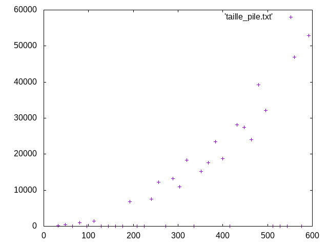

# Exploration

## Animations

## Ordre des voisins

Le meilleur ordre pour le parcours des voisins est le tas entrelacé car en terme de défaut de cache, on peut charger un seul bloc et la probabilité pour que les voisins d'un point du bloc soient dans le bloc (et donc déjà chargé) est plus élevé. En effet, dans le parcours par tas normal, il y a forcément un voisin non parcouru qui n'est pas sur la ligne (qui a été chargée) et donc qui ajoute des défauts de caches, de même pour le parcours par pile n'ayant pas d'ordonnancement les défauts de caches ne sont que plus grands. 

## Taille des structures

En ordonée nous avons la taille max de la pile ou du tas et en abscisse la taille de l'image.

On voit que le parcours par tas entrelacé est plus performant que le parcours par tas qui lui-même est plus performant que le parcourse par pile.
C'est lié au fait que lorsque l'on parcourt par pile, on accumule au fur et à mesure dans la pile des éléments car il n'y a pas d'ordre précis dans le parcours ainsi, il y a moins de chance que des voisins du nouveau poit à traiter aient déjà été parcouru, ce qui augmente grandement la taille de la pile. A l'inverse, pour les deux autres méthodes, la probabilité que les voisins d'un point aient déjà été visité est trés grande puisque l'on traite successivement des points de la même ligne ou du même bloc en fonction des algorithmes. On en déduit que la taille des tas va grandir moins vite.

## Pire cas (tas quadratique)

En rose les voisins, non traités, ajoutés dans le tas lors du parcours et en bleu clair le parcours fait. 

Il faut un graphe en serpent, en effet, si l'on en suit la figure précédente, on se rend compte que le nombre maximal de sommet dans le tas (illustré sur le schéma) est en $\dfrac{n}{3} (n-1)$ ce qui est équivalent à $\dfrac{1}{3}n^2$ ce qui en fait un $O(n^2)$. Ce cas là montre donc un cas où le parcours par tas est quadratique.

# Vue dégagée

## Accès

En terme de défaut de cache les accès verticaux sont plus coûteux que les accès horizontaux car la ligne est chargée dans le cache, alors que pour une colone, il faut charger toutes les lignes une par une.

## Défauts

il faut un graphe

## Analyse des comportements

On voit que...
Ça s'explique parce que...

## Tests additionnels

On a aussi regardé....
